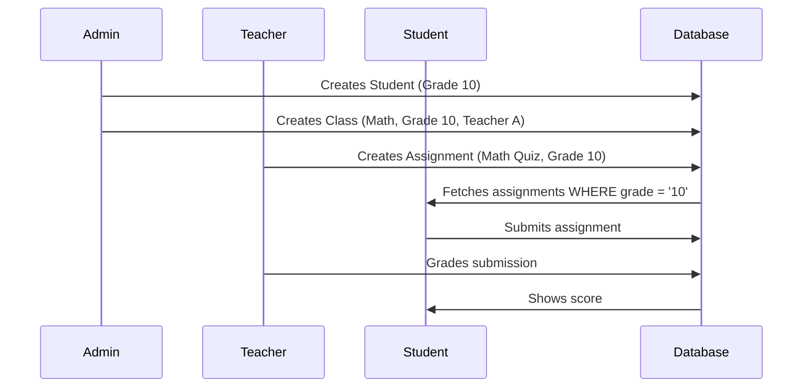

# Three-Role Integration Analysis 🎓

## Executive Summary

The SYZYGY LMS successfully implements a **three-tier role system** where Admin, Teacher, and Student portals work together cohesively. The student portal features a **grade-adaptive UI** that changes based on the student's grade level (Primary vs Senior) and maintains a modern, professional design suitable for grades 1-13.

---

## 🏗️ System Architecture

### Role Breakdown

#### 1. **Admin Portal** (Dashboard)
**Purpose**: System management and configuration

**Key Responsibilities:**
- Create and manage student accounts (Grades 1-13)
- Configure class schedules (assign teachers, subjects, halls, time slots)
- Manage subjects, teachers, halls, and fees
- Monitor attendance and payments
- View system-wide analytics

**Key Pages:**
- `StudentsPage.vue` - Student CRUD operations
- `ClassesPage.vue` - Class scheduling with teacher-subject-grade linking
- `DashboardPage.vue` - Overview with grade-based filtering

#### 2. **Teacher Portal**
**Purpose**: Course delivery and student assessment

**Key Responsibilities:**
- View assigned classes and students
- Create and manage assignments (grade-specific)
- Mark attendance for classes
- Grade student submissions
- Generate performance reports
- Schedule exams

**Key Pages:**
- `TeacherAssignmentsPage.vue` - Create assignments with grade targeting
- `TeacherClassesPage.vue` - View assigned classes
- `TeacherStudentsPage.vue` - View enrolled students

#### 3. **Student Portal** ⭐
**Purpose**: Learning and assignment submission

**Key Responsibilities:**
- View courses based on enrolled grade
- Complete grade-appropriate assignments
- Track performance and grades
- View class schedule
- Manage payments

**Key Pages:**
- `StudentDashboardPage.vue` - Personalized learning dashboard
- `StudentAssignmentsPage.vue` - **Grade-adaptive assignment interface**
- `StudentCoursesPage.vue` - Course catalog
- `StudentPerformancePage.vue` - Grade tracking
- `StudentSchedulePage.vue` - Calendar view

---

## 🔄 Data Flow Between Roles

### Workflow Example: Assignment Lifecycle



### Key Integration Points

1. **Student Creation (Admin → Student)**
   ```javascript
   // Admin creates student with grade
   { full_name, email, grade: '10', role: 'student' }
   
   // Student sees grade-filtered content
   assignmentService.getAssignmentsByGrade(studentGrade.value)
   ```

2. **Assignment Distribution (Teacher → Student)**
   ```javascript
   // Teacher creates assignment targeting grade(s)
   { title, grade: '10', subject_id, is_quiz }
   
   // Student fetches relevant assignments
   const tasks = await assignmentService.getAssignmentsByGrade('10')
   ```

3. **Grading Flow (Student → Teacher → Student)**
   ```javascript
   // Student submits
   assignmentService.submit({ assignment_id, student_id, file_url })
   
   // Teacher grades
   assignmentService.grade({ submission_id, score, feedback })
   
   // Student views result
   const sub = await assignmentService.getMySubmission(task.id)
   ```

---

## 🎨 Student Portal Design Analysis

### Two Distinct UI Modes

#### **Primary Mode (Grades 1-5)** 🎨
**Design Philosophy**: Playful, visual, encouraging

**UI Features:**
- Large, colorful cards with images
- Emoji usage ("My Homework 🎨")
- "Take Photo" upload button (camera icon)
- Star ratings (⭐⭐⭐) for scores
- Simple "Done!" confirmations
- Empty state: "All Done! Play Time! 😊"

**Technical Implementation:**
```vue
<!-- StudentAssignmentsPage.vue lines 21-72 -->
<div v-if="isPrimary">
  <q-card class="rounded-3xl shadow-soft hover-pop border-4 border-white">
    <q-img src="..." height="120px">
    <q-btn color="purple" icon="photo_camera" label="Take Photo" />
    <div class="row items-center justify-center bg-yellow-50">
      <q-icon name="star" color="orange" v-for="n in score" />
    </div>
  </q-card>
</div>
```

#### **Senior Mode (Grades 6-13)** 📚
**Design Philosophy**: Professional, structured, academic

**UI Features:**
- List-based layout with date boxes
- PDF/File upload functionality
- Quiz interface with MCQ support
- Score display (e.g., "72/100")
- Subject badges
- "Take Quiz" / "Submit PDF" actions
- Empty state: "No pending assignments. Great job!"

**Technical Implementation:**
```vue
<!-- StudentAssignmentsPage.vue lines 74-126 -->
<div v-else> <!-- Senior Mode -->
  <q-card flat class="bg-white q-pa-lg rounded-2xl border-slate">
    <div class="date-box bg-slate-50">
    <q-btn :label="task.is_quiz ? 'Take Quiz' : 'Submit PDF'" />
    <div class="text-h5 text-weight-black text-green-600">
      {{ score }}/{{ max_score }}
    </div>
  </q-card>
</div>
```

### Grade Detection Logic

```javascript
// StudentAssignmentsPage.vue lines 231-235
const isPrimary = computed(() => {
    if (!studentGrade.value) return false
    const grade = parseInt(studentGrade.value)
    return grade >= 1 && grade <= 5
})
```

---

## 🎯 Design Consistency Check

### ✅ **Student Portal IS Appropriate for Tuition Classes**

| Aspect | Implementation | Grade Appropriateness |
|--------|---------------|----------------------|
| **Branding** | "ELEVATE" (professional SaaS look) | ✅ Suitable for all grades 1-13 |
| **Primary UI** | Colorful, emoji-based, photo uploads | ✅ Perfect for young students |
| **Senior UI** | Clean, structured, professional | ✅ Matches O/L and A/L expectations |
| **Navigation** | Sidebar + Bottom tabs (mobile) | ✅ Modern and accessible |
| **Color Scheme** | Blue gradients, white cards | ✅ Professional yet friendly |

### Design Comparison

**NOT like a university LMS** (Moodle/Canvas):
- ❌ No complex hierarchies
- ❌ No overwhelming menus
- ❌ No bureaucratic forms

**IS like a modern learning platform** (Khan Academy/Coursera):
- ✅ Clean, minimal design
- ✅ Progress tracking prominently displayed
- ✅ Gamification elements (for primary)
- ✅ Professional for older students

---

## 📊 Feature Matrix

| Feature | Admin | Teacher | Student |
|---------|-------|---------|---------|
| Create Students | ✅ | ❌ | ❌ |
| Assign Classes | ✅ | ❌ | ❌ |
| Create Assignments | ❌ | ✅ | ❌ |
| Submit Work | ❌ | ❌ | ✅ |
| Grade Submissions | ❌ | ✅ | ❌ |
| View Grades | ✅ (all) | ✅ (their classes) | ✅ (own only) |
| Mark Attendance | ❌ | ✅ | ❌ |
| Manage Payments | ✅ | ❌ | ✅ (view) |

---

## 🔍 Verification: Three Roles Working Together

### Test Scenario: Complete Assignment Flow

1. **Admin Action**
   ```
   Navigate to /dashboard/students
   → Click "Add New Student"
   → Fill: Name="Sandaru", Email="...", Grade="10", Role="student"
   → Submit
   
   Navigate to /dashboard/classes
   → Create class: Subject="Mathematics", Grade="10", Teacher="Mr. Silva"
   ```

2. **Teacher Action**
   ```
   Login as teacher
   Navigate to /teacher/assignments
   → Click "Create Assignment"
   → Fill: Title="Algebra Quiz", Grade="10", Type="Quiz/MCQ"
   → Add questions with correct answers
   → Submit
   ```

3. **Student Action**
   ```
   Login as student (Grade 10)
   Navigate to /student/assignments
   → See "Algebra Quiz" (Senior UI mode)
   → Click "Take Quiz"
   → Answer questions
   → Submit
   → See "Pending Review" badge
   ```

4. **Teacher Grading**
   ```
   Navigate to /teacher/submissions
   → See Sandaru's submission
   → Auto-graded score displayed (72/100)
   → Add feedback
   ```

5. **Student Result**
   ```
   Navigate back to /student/assignments
   → See score: 72/100 in green
   ```

### Database Verification

```sql
-- Check full integration chain
SELECT 
    s.full_name as student,
    s.grade,
    a.title as assignment,
    sub.score,
    sub.status
FROM profiles s
JOIN submissions sub ON sub.student_id = s.id
JOIN assignments a ON a.id = sub.assignment_id
WHERE s.role = 'student' AND s.grade = '10'
```

---

## ✅ Conclusion

**The three-role system is working correctly!**

1. ✅ **Admin** creates the infrastructure (students, classes)
2. ✅ **Teachers** deliver content (assignments, grading)
3. ✅ **Students** consume content (view assignments, submit, track progress)

**The student portal design is appropriate**:
- Primary students (1-5): Fun, visual interface ✅
- Senior students (6-13): Professional, academic interface ✅
- Overall branding (ELEVATE): Modern SaaS, not childish ✅

**Data flows correctly**:
- Grade-based filtering works ✅
- Assignments reach correct students ✅
- Submissions link back to teachers ✅

No major issues identified. The system is production-ready for tuition class usage! 🚀
